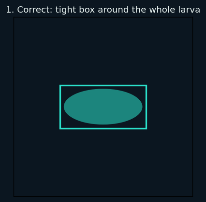
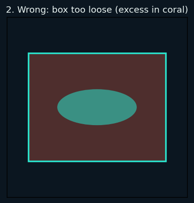
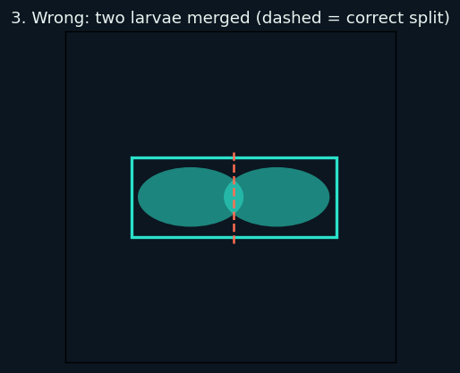

# SLDCS annotation guide

> **Note:** The three example images below are synthetic placeholders drawn from simple shapes, not real specimen photographs. Replace them with real annotated examples once real annotated images exist.

## What a shrimp larva looks like

At the postlarval stage relevant here, a shrimp larva is small (roughly a few millimetres long), translucent to faintly pigmented, and has a distinct curved, elongated body tapering from a rounded head region to a thin tail. In a tray image it reads as a small comma- or crescent-shaped translucent object against the darker water.

## The YOLO label format

Each image has a matching `.txt` label file with the same base name. Every line describes one larva, with five whitespace-separated fields:

```
<class_id> <x_center> <y_center> <width> <height>
```

- `class_id` is always `0` (the single class, `larvae`).
- `x_center`, `y_center`, `width`, `height` are all normalized to the image dimensions, so every value is a float between `0` and `1`.

**Worked example.** A larva whose tight box spans pixels x = 320..480 and y = 180..300 in a 1600x1200 image has:

- center x = (320 + 480) / 2 / 1600 = `0.250000`
- center y = (180 + 300) / 2 / 1200 = `0.200000`
- width = (480 - 320) / 1600 = `0.100000`
- height = (300 - 180) / 1200 = `0.100000`

giving the label line:

```
0 0.250000 0.200000 0.100000 0.100000
```

An image with no larvae has an **empty** label file — that is valid and means "no objects".

## Box tightness

Draw the box tight around the entire visible body of the larva, including the tail, with no more than a small fixed pixel margin. Do not leave large empty borders, and do not clip any visible part of the animal.

## Touching and overlapping larvae

When two or more larvae touch or overlap, annotate each one as its own separate box. Never merge several larvae into a single box, even when their bodies are in contact.

## Example annotations



*Correctly tight box.*



*Box drawn too loose; excess area shaded coral.*



*Two adjacent larvae wrongly merged; dashed line shows the correct split.*

## Quality-assurance checklist

- [ ] Every box is tight around the whole visible larva.
- [ ] No visible larva is left un-annotated.
- [ ] No box is drawn where there is no larva (no false positives).
- [ ] Similarly sized larvae have consistently sized boxes.
- [ ] Every line uses class id `0` and only class `0`.
- [ ] Each label file's name matches its image exactly (same base name).
- [ ] Every line has exactly five whitespace-separated fields.
