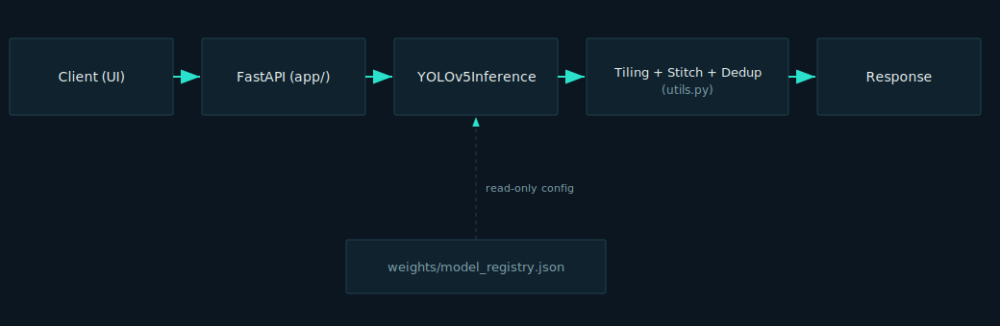

# SLDCS architecture

SLDCS is a single-process FastAPI service that turns a full-tray specimen
photograph into an annotated image and a precise larvae count through a fixed
five-stage pipeline. This document describes how the pieces fit together.

## System diagram

The client sends an image to the FastAPI layer, which hands it to the single
`ModelInference` engine. The engine drives the tiling/stitching/deduplication
helpers in `utils.py` and returns a result the API serializes back to the
client. `weights/model_registry.json` is a read-only configuration input: it
names the production checkpoint the engine loads, and nothing else in the system
hardcodes a model path.

## The five-stage pipeline

Every detection request runs these stages in order:

1. **Tile** — `crop_and_tile_image` segments the image into overlapping
   640×640 tiles (64px overlap) so small larvae are never lost to downscaling.
2. **Detect** — `ModelInference` runs the model on each tile independently.
3. **Stitch** — `stitch_results` maps each tile's detections back into the
   original image's coordinate space using the tile origins.
4. **Deduplicate** — `remove_duplicate_detections` reconciles the same larva
   detected in two overlapping tiles into a single detection via class-aware,
   confidence-ordered non-maximum suppression.
5. **Report** — the API assembles the count, statistics, annotated image, and
   per-detection list into the response.

## Modules and responsibilities

| Module | Responsibility |
|---|---|
| `app/main.py` | FastAPI app assembly, routing, startup/shutdown, static mount. |
| `app/routes.py` | Upload validation and response assembly for the endpoints. |
| `app/inference.py` | The one class that loads and runs the model (`ModelInference`); the only module that imports torch or the YOLOv5 API. |
| `app/utils.py` | Pure tiling/stitching/deduplication maths plus drawing, statistics, and base64 helpers. |
| `app/models.py` | Pydantic request/response schemas. |
| `app/config.py` | `Settings`: loads and validates configuration; resolves the model path from the registry. |
| `weights/model_registry.json` | Single source of truth for the production model path. |

## Two operating modes

The system behaves identically whether it runs on the stock pretrained
checkpoint or a project-trained one — the API surface, UI, and infrastructure do
not change. The only difference is which checkpoint `model_registry.json` names
as `current_production`:

- **Before training data exists (current):** runs on the stock Ultralytics
  YOLOv5s COCO-pretrained checkpoint so the whole system can be built and
  verified end to end.
- **After training:** runs on the project-trained checkpoint selected by
  mAP@0.5, registered in place of the pretrained entry.

## Request lifecycle

1. A client uploads one or more images to `POST /detect` (or `POST /batch-detect`).
2. `routes.validate_upload` checks each file's type and size.
3. Decoded images are handed to `ModelInference.detect`, which runs the
   tile→detect→stitch→dedupe stages off the event loop in a worker thread.
4. `routes` assembles a `DetectionResult` (count, detections, statistics, and —
   for `/detect` — a base64 annotated image) and returns it.
